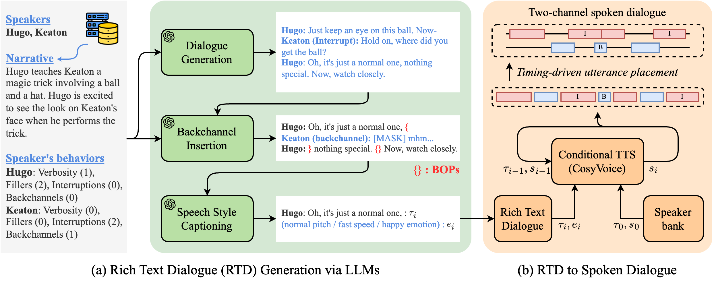

# 🎙️ Behavior-SD
Official repository for our **NAACL 2025** paper:  
<a href=""><b>Behavior-SD: Behaviorally Aware Spoken Dialogue Generation with Large Language Models</b></a>  
[Sehun Lee*](https://yhytoto12.github.io/), [Kang-wook Kim*](https://kwkim.me/), [Gunhee Kim](https://vision.snu.ac.kr/gunhee/)  (* Equal contribution)  

> 🏆 **SAC Award Winner** in Speech Processing and Spoken Language Understanding

## 🔗 Links
- 🌐 [**Project Page**](https://yhytoto12.github.io/Behavior-SD)
- 📂 [**Dataset** (Coming Soon)](https://drive.google.com/drive/folders/1BUjqQvYDpUPAzAyM9zSg3Y3vc1HYjwd0?usp=sharing)

## 📖 Overview
We explores how to generate natural, behaviorally-rich spoken dialogues using large language models (LLMs).  
We introduce:
- **Behavior-SD** Dataset: 108K full-duplex dialogues (2,164 hours) with rich speaker-wise behavioral annotations.  
- **BeDLM**: A novel end-to-end LLM-based spoken dialogue generator conditioned on narrative and behavioral traits.  

<p align="center">
    
</p>

Unlike existing spoken dialogue datasets that neglect full-duplex dynamics (e.g., interruptions, backchannels), Behavior-SD captures and models realistic conversational behaviors, enabling more natural and human-like spoken dialogues.

## 📂 Dataset
Behavior-SD provides large-scale, behavior-annotated spoken dialogues.

- Data Structure
```
Behavior-SD/
    ├── valid_ids.json
    ├── {split}/      # train, validation, test
        ├── audios/
            ├── {soda_index:010d}/
                ├── dialogue.wav
                ├── meta_info.json
```
- `meta_info.json` contents
```JSON
{
  "soda_split": "train",
  "soda_index": 4,
  "narrative": "Cornell knows what Dontrell is thinking...",
  "speakers": ["Cornell", "Dontrell"],
  "behaviors": [
    {"utterance_length": 0, "filler_words": 0, "backchannels": 0, "interruptions": 2},
    {"utterance_length": 0, "filler_words": 2, "backchannels": 0, "interruptions": 0}
  ],
  "num_turns": 10,
  "utterances": [
    {
      "uttr_idx": 0,
      "uttr_type": null,
      "speaker_idx": 1,
      "speaker": "Dontrell",
      "tts_text": "So, I was thinking... um... we should probably plan...",
      "dur_samples": 60672,
      "start_time": 0.0,
      "end_time": 2.75156462585034
    },
    ...
  ],
  "tts_speaker_ids": ["0001024622_0", "0000805189_1"],
  "tts_genders": ["female", "male"],
  "statistics": {
    "num_utterances": [5, 5],
    "num_turntaking": [5, 4],
    "durations": [5.53, 25.35],
    "num_interruptions": [2, 0],
    "num_backchannels": [0, 0],
    "num_filler_words": [0, 8]
  }
}
```

Behavior annotations are provided at utterance and speaker levels, enabling fine-grained control and analysis.


## 📌 Citation

If you find our work useful, please consider citing us:

```bib
@inproceedings{sehun@behaviorsd,
  title     = {Behavior-SD: Behaviorally Aware Spoken Dialogue Generation with Large Language Models},
  author    = {Sehun Lee and Kang-wook Kim and Gunhee Kim},
  booktitle = {Proceedings of the 2025 Annual Conference of the Nations of the Americas Chapter of the Association for Computational Linguistics},
  year      = {2025}
}
```

## ⚡ TODOs
- [x] Release dataset
- [ ] Release code for BeDLM